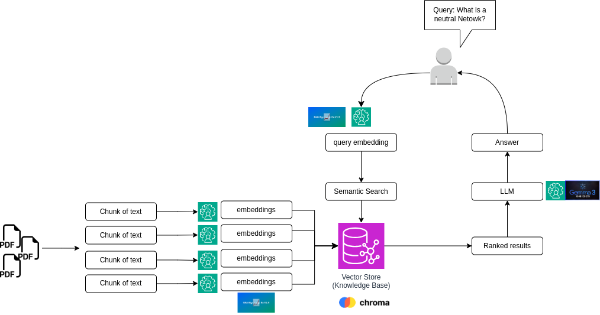

# # RAG (Retrieval-Augmented Generation) System

This project implements a Retrieval-Augmented Generation (RAG) system using Python. It allows you to load PDF documents, split them into chunks, embed the chunks, store them in a vector database, and query the database using a large language model (LLM) for generating responses.

## Project Structure

- **populate_database.py**: Script to load PDFs, split them into chunks, and store them in ChromaDB.
- **query_data.py**: Script to query the ChromaDB and generate responses using the Gemma 3 model.
- **requirements.txt**: List of all required Python packages.
- **data/**: Directory containing PDF files to be loaded. 
- **myDB/**: Directory where ChromaDB stores its data.
## Notes

- Ensure that all dependencies are installed by running:
    ```bash
	conda env create -f environment.yml	```

- The `data/` directory should contain the PDF files you want to process.

- The `myDB/` directory is used by ChromaDB to store the vector database. You can reset it using the `--reset` flag in `populate_database.py`.
## Requirements

## Quick Setup

### 1. Clone the Repo
```bash
git clone git@github.com:OutWork-HCM/RAG.git
cd RAG
```

### 2. Add Your Hugging Face Token
Create a .env file:
```text
HF_TOKEN=your_huggingface_token_here
```
Get your token from [Hugging Face](https://huggingface.co/settings/tokens).

### 3. Set Up the Environment
Run the setup script:
```bash
bash
	conda env create -f environment.yml
```
### 4. Activate the Environment
```bash
conda activate RAG_Marker
```

## Usage

```bash
streamlit run app.py
```
## Dependencies

## License

MIT License
